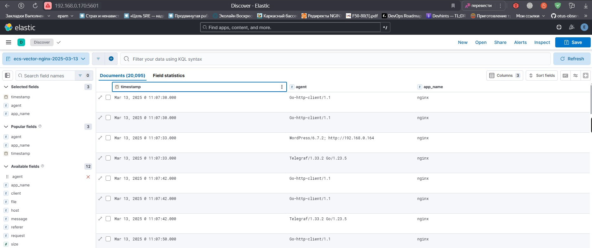

# GAP-1

## В данном репозитории находят роли для деплоя из Gitlab

### Для деплоя wordpress приложения необходимо выполнить job deploy-app


Результатом станет установка сервисов nginx, php, memcached, mysql и CMS wordpress

### Для деплоя системы мониторинга следует воспользоваться  job deploy-monitoring и deploy-exporters соответственно


Результатом будет установленный Prometeus, Grafana, набор exporters и AlertManager


# Подключение VictoriaMetric

Для установки VictoriaMetric следует выполнить роль  deploy-victoria. Конфигурирование Prometeus в данном примере осуществляется в ручную. Файл конфигурации находится в каталоге GAP1


### Подключаем хранилище Victoria к Grafana


### И подключим дашбор для мониторинга Victoria


# Настройка алертинга

Для обновление правил отправки алертов а также изменения самих алертов добавлена роль alert-update. Ознакомиться с файлами конфигурации можно в каталоге Gap1


Для приемки сообщений создан ТГ канал. с двуми трэдами Warning и Critical. Сообзения с различным severity поступают в соответствующий трэд


# Grafana - продвинутое использование


# Установка Zabbix

В ручную развернуты забикс-сервер изабикс-агент.


Cформировать скрипт генерирующий метрики:

```
import random
import json

# Создаём список метрик
metrics = [
    {"{#METRIC}": "biba", "{#VALUE}": random.randint(0, 100)},
    {"{#METRIC}": "boba", "{#VALUE}": random.randint(0, 100)},
    {"{#METRIC}": "ziza", "{#VALUE}": random.randint(0, 100)},
]

# Преобразуем в JSON и выводим
json_result = json.dumps(metrics, indent=4)
print(json_result)
```
Добавлен UserParametr для получения метрик из скрипта

```
UserParameter=otus[*], python3 /etc/zabbix/zabbix_agent2.d/test.py
```
Добавил правило обнаружения


Портотип итема


Портотип тригера**


** порог понижен до 80 так как не удавалось долго поймать срабатывание тригера

Убеждаемся что метрики обнаружилсь, тригеры добавились, данные поступают.


Настроена отправка оповещений в ТГ канал


# Установка и настройка TICK стека

### Установка Telegraf на VM c wordpress

```
curl --silent --location -O \
https://repos.influxdata.com/influxdata-archive.key \
&& echo "943666881a1b8d9b849b74caebf02d3465d6beb716510d86a39f6c8e8dac7515  influxdata-archive.key" \
| sha256sum -c - && cat influxdata-archive.key \
| gpg --dearmor \
| sudo tee /etc/apt/trusted.gpg.d/influxdata-archive.gpg > /dev/null \
&& echo 'deb [signed-by=/etc/apt/trusted.gpg.d/influxdata-archive.gpg] https://repos.influxdata.com/debian stable main' \
| sudo tee /etc/apt/sources.list.d/influxdata.list
sudo apt-get update && sudo apt-get install telegraf
```

### Генерация конфигурации

```
telegraf config > telegraf.conf
```

Настроил для Telegraf сбор и отправку метрик в [01-telegraf.conf](TICK/Telegraf/01-telegraf.conf) по пути /etc/telegraf/telegraf.d/

### Развёртывание Influxdb, Chronograf, Kapacitor

Influxdb, Chronograf, Kapacitor развернуn на отдельной машине с помощью docker-compose

```
networks:
  monitoring:
    driver: bridge

services:
  influxdb:
    image: influxdb:2.7
    restart: always
    container_name: influxdb
    hostname: influxdb
    ports:
      - 8086:8086
    environment:
      - DOCKER_INFLUXDB_INIT_MODE=setup
      - DOCKER_INFLUXDB_INIT_USERNAME=admin
      - DOCKER_INFLUXDB_INIT_PASSWORD=adminpassword
      - DOCKER_INFLUXDB_INIT_ORG=home
      - DOCKER_INFLUXDB_INIT_BUCKET=cms
      - DOCKER_INFLUXDB_INIT_ADMIN_TOKEN=my-super-secret-auth-token
    volumes:
      - ./volumes/influxdb/data:/var/lib/influxdb2:rw
      - ./volumes/influxdb/config:/etc/influxdb2
    networks:
      monitoring:
        aliases:
         - influxdb

  chronograf:
    image: chronograf:1.10.3
    restart: always
    container_name: chronograf
    hostname: chronograf
    ports:
      - 8888:8888
    environment:
      - INFLUXDB_URL=http://192.168.0.184:8086
      - INFLUXDB_ORG=home
      - INFLUXDB_TOKEN=my-super-secret-auth-token
      - KAPACITOR_URL=http://192.168.0.184:9092
#      - KAPACITOR_USERNAME=admin
#      - KAPACITOR_PASSWORD=admin
    volumes:
      - ./volumes/chronograf:/var/lib/chronograf:rw
    depends_on:
      - influxdb
    networks:
      monitoring:
        aliases:
         - chronograf

  kapacitor:
    image: kapacitor:1.7
    restart: always
    container_name: kapacitor
    hostname: kapacitor
    ports:
      - 9092:9092
    environment:
      KAPACITOR_HOSTNAME: kapacitor
      KAPACITOR_HTTP_AUTH_ENABLED: "false"
      KAPACITOR_INFLUXDB_0_URLS_0: "http://192.168.0.184:8086"
      KAPACITOR_INFLUXDB_0_ENABLED: "true"
      KAPACITOR_INFLUXDB_0_DEFAULT: "true"
      KAPACITOR_INFLUXDB_0_NAME: "cms"
      KAPACITOR_INFLUXDB_0_TOKEN: "my-super-secret-auth-token"
      KAPACITOR_INFLUXDB_0_DISABLE_SUBSCRIPTIONS: "true"
      KAPACITOR_INFLUXDB_0_KAPACITOR_HOSTNAME: kapacitor
      KAPACITOR_AS_ROOT: "true"
      KAPACITOR_LOAD_ENABLED: "true"
      KAPACITOR_LOAD_DIR: "/var/lib/kapacitor/load"
      KAPACITOR_LOGGING_FILE: "/var/lib/kapacitor/kapacitor.log"
      KAPACITOR_LOGGING_LEVEL: debug
      KAPACITOR_TELEGRAM_ENABLED: "true"
      KAPACITOR_TELEGRAM_URL: "https://api.telegram.org/bot"
      KAPACITOR_TELEGRAM_TOKEN: ${TG_TOKEN}
      KAPACITOR_TELEGRAM_CHAT_ID: ${TG_CHAT_ID}
      KAPACITOR_TELEGRAM_PARSE_MODE: "HTML"
#      KAPACITOR_INFLUXDB_0_USERNAME: admin
#      KAPACITOR_INFLUXDB_0_PASSWORD: secret-auth-token
    volumes:
#      - ./kapacitor/kapacitor.conf:/etc/kapacitor/kapacitor.conf:ro
      - ./volumes/kapacitor:/var/lib/kapacitor:rw
      - ./kapacitor/tasks:/var/lib/kapacitor/load/tasks:rw
    depends_on:
      - influxdb
    networks:
      monitoring:
        aliases:
         - kapacitor

```
### Сформирован дашборд в хронографе


### Проверил что алерты в kapasitor работают и отпрвляются в ТГ


# Beats - инструменты доставки данных

Установка Filebeat и Metricbeat производится посредством запуска ansible плейбука в GitlabCI


Конфигурационные файлы находятся в каталогах

- [filebeat](Ansible/roles/install_filebeat)
- [metricbeat](Ansible/roles/install_metricbeat)
  
## Установка Elasticsearch, Kibana и Heartbeat

 сервисы развёрнуты с помощью docker-compose.yml

```
networks:
  monitoring:
    driver: bridge

volumes:
  elastic_vol:
    driver: local

services:
  elastic:
    image: elasticsearch:8.15.3
    container_name: elastic
    environment:
      - node.name=elastic
      - cluster.name=es-docker-cluster
      - discovery.type=single-node
      - bootstrap.memory_lock=true
      - "ES_JAVA_OPTS=-Xms512m -Xmx512m"
      - ELASTIC_PASSWORD='11111'
      - xpack.security.enabled=true
    ulimits:
      memlock:
        soft: -1
        hard: -1
    volumes:
      - elastic_vol:/usr/share/elasticsearch/data
    ports:
      - 9200:9200
      - 9300:9300
    networks:
      - monitoring

  kibana:
    image: kibana:8.15.3
    container_name: kibana
    environment:
      SERVER_NAME: kibana
      SERVER_PUBLICBASEURL: 'http://192.168.0.170:5601'
      ELASTICSEARCH_HOSTS: '["http://192.168.0.170:9200"]'
      ELASTICSEARCH_SSL_VERIFICATIONMODE: 'none'
      ELASTICSEARCH_USERNAME: 'kibana'
      ELASTICSEARCH_PASSWORD: 'aGg97x_hqSXsYC1JPLk3'
    ports:
      - 5601:5601
    networks:
      - monitoring
    depends_on:
      - elastic

  heartbeat:
    image: elastic/heartbeat:8.15.3
    container_name: heartbeat
    volumes:
      - ./heartbeat/heartbeat.yml:/usr/share/heartbeat/heartbeat.yml:ro
    environment:
        - strict.perms=false
    cap_add:
      - NET_RAW
    networks:
      - monitoring
    depends_on:
      - elastic
```

## Логи, метрики

В Kibana отображаются логи с Filebeat


В Kibana доступны метрики собираемые Metricbeat, их можно посмотреть на дашбордe


А также доступны метрики собираемые Heartbeat


# Системы агрегации сообщений Logstash/Vector

Logstash добавлен в предыдущий компз файл ELK

```
  logstash:
    image: logstash:8.15.3
    container_name: logstash
    volumes:
      - ./logstash/:/usr/share/logstash/pipeline/:rw
    ports:
      - 5044:5044
    environment:
      monitoring.enabled: "false"
    networks:
      - monitoring
    depends_on:
      - elastic
```
Файл конфигурации

```
input {
    beats {
        port => "5044"
    }
}
filter {
    if [event][module] == "nginx-filestream" {
        grok {
            match => { "message" => "%{COMBINEDAPACHELOG}"}
        }
        geoip {
             source => "[source][address]"
             target => "geoip"
        }
    }
    if [event][module] == "mysql-filestream" {
        grok {
            match => { "message" => "%{TIMESTAMP_ISO8601:date} %{NOTSPACE:thread} \[%{NOTSPACE:label}\] \[%{NOTSPACE:err_code}\] \[%{NOTSPACE:subsystem}\] %{GREEDYDATA:event_message}"}
        }
    }
    if [event][module] == "php-fpm-filestream" {
        grok {
            match => { "message" => "\[%{GREEDYDATA:date}\] %{LOGLEVEL:log_level}\: %{GREEDYDATA:event_message}"}
        }
    }
}
output {
    elasticsearch {
        hosts    => [ "192.168.0.170:9200" ]
        user     => "elastic"
        password => "eH4_AjRigsd11==t+Atu"
        index    => "ecs-logstash-%{[event][module]}-%{+yyyy.MM.dd}"
    }
#     stdout { codec => rubydebug }
}
```

 [Filebeat](Ansible/roles/install_filebeat/templates/filebeat.yml.j2) перенастроен на отправку логов в logstash

Логи записываются в отдельные индексы


Парсятся с помощью описанных grok фильтров


Для установки Vector использована роль [ansible](Ansible/roles/install_vector) (не для прода, работает не стабильно)


Для доступа Vector к файлам логов добавил его пользователя в необходимые группы и поправил права на каталогах

```
usermod -a -G www-data vector
usermod -a -G mysql vector
chmod 644 /var/log/nginx/
```
Логи  записываются в отдельные индексы


успешно парсятся с помощью VRL



# Grafana Loki - управление логами и доставка 

Для сбора логов установил Grafana Alloy по инструкции https://grafana.com/docs/alloy/latest/set-up/install/

Для доступа Alloy к файлам логов добавил его пользователя в необходимые группы и поправил права на каталогах

В UI Alloy виден статус и граф компонентов


Файл конфигурации Alloy
```
 local.file_match "local_files" {
     path_targets = [{"__path__" = "/var/log/nginx/access.log"}]
     sync_period = "5s"
 }

 loki.source.file "log_scrape" {
    targets    = local.file_match.local_files.targets
    forward_to = [loki.process.filter_logs.receiver]
    tail_from_end = true
  }


  loki.process "filter_logs" {
    stage.drop {
        source = ""
        expression  = ".*Connection closed by authenticating user root"
        drop_counter_reason = "noisy"
      }
    forward_to = [loki.write.grafana_loki.receiver]
    }

  loki.write "grafana_loki" {
    endpoint {
      url = "http://192.168.0.183:3100/loki/api/v1/push"

      // basic_auth {
      //  username = "admin"
      //  password = "admin"
      // }
    }
  }
```
Grafana и Grafana Loki запустил с помощью docker-compose.yml

```
networks:
  monitoring:
    driver: bridge

services:
  grafana:
    image: grafana/grafana:latest
    container_name: grafana
    user: "root"
    volumes:
      - ./grafana/data:/var/lib/grafana
      - /etc/timezone:/etc/timezone:ro
      - /etc/localtime:/etc/localtime:ro
    environment:
      GF_SECURITY_ADMIN_USER: admin
      GF_SECURITY_ADMIN_PASSWORD: admin
      GF_SERVER_ROOT_URL: "http://192.168.0.183:3000"
      GF_SERVER_DOMAIN: "home.local"
      GF_PATHS_PROVISIONING: /usr/share/grafana/conf/provisioning
    ports:
      - 3000:3000
    restart: always
    networks:
      - monitoring

  loki:
    image: grafana/loki:latest
    container_name: loki
    command: -config.file=/mnt/config/loki-local-config.yaml
    restart: always
    volumes:
      - ./loki:/mnt/config:rw
    ports:
    - "3100:3100"
    networks:
      - monitoring
```
Конфигурация Loki:
```
auth_enabled: false

server:
  http_listen_port: 3100
  grpc_listen_port: 9096

common:
  instance_addr: 127.0.0.1
  path_prefix: /tmp/loki
  storage:
    filesystem:
      chunks_directory: /tmp/loki/chunks
      rules_directory: /tmp/loki/rules
  replication_factor: 1
  ring:
    kvstore:
      store: inmemory

query_range:
  results_cache:
    cache:
      embedded_cache:
        enabled: true
        max_size_mb: 100

schema_config:
  configs:
    - from: 2025-03-17
      store: tsdb
      object_store: filesystem
      schema: v13
      index:
        prefix: index_
        period: 24h
```

В Grafane видно что постпупают данные из loki


# Opensearch

## Fluent Bit
Установка выполнена по инструкции с [сайта](https://docs.fluentbit.io/manual/installation/linux/ubuntu)

Файл конфигурации
```
[SERVICE]
    Flush        5
    Daemon       Off
    Log_Level    info
    Parsers_File parsers.conf
    Plugins_File plugins.conf
    HTTP_Server  Off
    HTTP_Listen  0.0.0.0
    HTTP_Port    2020
    storage.metrics on

[INPUT]
    Name          tail
    Path          /var/log/nginx/*log
    Refresh_Interval 5
    Tag           nginx

[INPUT]
    Name          tail
    Path          /var/log/php8.1-fpm.log
    Refresh_Interval 5
    Tag           php-fpm

[INPUT]
    Name          tail
    Path          /var/log/mysql/error.log
    Refresh_Interval 5
    Tag           mysql

[FILTER]
    Name          modify
    Match         nginx
    Add           app_name nginx

[FILTER]
    Name          modify
    Match         php-fpm
    Add           app_name php-fpm

[FILTER]
    Name          modify
    Match         mysql
    Add           app_name mysql

[OUTPUT]
    Name          http
    Match         *
    Host          192.168.0.183
    Port          2021
    URI           /log/ingest
    Format        json

[OUTPUT]
    Name          stdout
    Match         *

```
## Data Prepper Opensearch и Opensearch Dashboard

Запущены через docker-compose
```
networks:
  monitoring:
    driver: bridge

volumes:
  opensearch_vol:
    driver: local

services:
  dataprepper:
    container_name: dataprepper
    image: opensearchproject/data-prepper:2.10.1
    volumes:
      - ./dataprepper/pipeline.yaml:/usr/share/data-prepper/pipelines/pipeline.yaml
    ports:
      - 2021:2021
    networks:
      - monitoring
    restart: always
    depends_on:
      - opensearch

  opensearch:
    image: opensearchproject/opensearch:2.18.0
    container_name: opensearch
    environment:
      - cluster.name=opensearch-docker-cluster
      - node.name=opensearch
      - discovery.type=single-node
      - bootstrap.memory_lock=true
      - "OPENSEARCH_JAVA_OPTS=-Xms512m -Xmx512m"
      - OPENSEARCH_INITIAL_ADMIN_PASSWORD=
    ulimits:
      memlock:
        soft: -1
        hard: -1
      nofile:
        soft: 65536
        hard: 65536
    volumes:
      - opensearch_vol:/usr/share/opensearch/data
    ports:
      - 9200:9200
      - 9600:9600
    networks:
      - monitoring

  opensearch-dashboards:
    image: opensearchproject/opensearch-dashboards:2.18.0
    container_name: opensearch-dashboards
    ports:
      - 5601:5601
    expose:
      - "5601"
    environment:
      OPENSEARCH_HOSTS: '["https://192.168.0.183:9200"]'
      OPENSEARCH_USERNAME: "admin"
      OPENSEARCH_PASSWORD: ""
    networks:
      - monitoring
    depends_on:
      - opensearch
```
Конфигурация приёма, парсинга и отправки логов описана в pipeline.yaml
```
log-pipeline:
  source:
    http:
      port: 2021
      ssl: false
  processor:
    - grok:
        grok_when: '/app_name == "nginx"'
        match:
          log: ['%{COMMONAPACHELOG}']
    - grok:
        grok_when: '/app_name == "php-fpm"'
        match:
          log: ['\[%{GREEDYDATA:event.date}\] %{LOGLEVEL:event.log_level}\: %{GREEDYDATA:event.message}']
    - grok:
        grok_when: '/app_name == "mysql"'
        match:
          log: ['%{TIMESTAMP_ISO8601:event.date} %{NOTSPACE:event.thread} \[%{NOTSPACE:event.label}\] \[%{NOTSPACE:event.err_code}\] \[%{NOTSPACE:event.subsystem}\] %{GREEDYDATA:event.message}']

  sink:
    - opensearch:
        hosts: ["https://192.168.0.183:9200"]
        insecure: true
        username: admin
        password: NtgkfzDtcyf2025
        index: os-dataprepper-${/app_name}-%{yyyy.MM.dd}
        template_type: index-template
    - stdout:

```
Видно что данные от Data Prepper записываются в Opensearch. Для каждого приложения логи помещаются в отдельный индекс.


С помощью grok-парсера в Data Prepper журналы разбираются по полям и их можно просмотреть в Opensearch Dashboard


