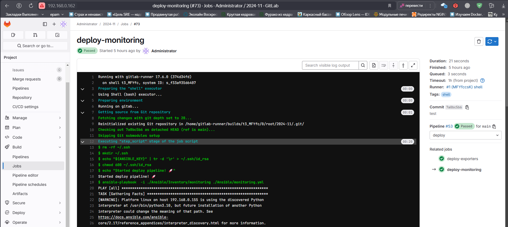

# GAP-1

## В данном репозитории находят роли для деплоя из Gitlab

### Для деплоя wordpress приложения необходимо выполнить job deploy-app

Результатом станет установка сервисов nginx, php, memcached, mysql и CMS wordpress

### Для деплоя системы мониторинга следует воспользоваться  job deploy-monitoring и deploy-exporters соответственно

Результатом будет установленный Prometeus, Grafana, набор exporters и AlertManager

