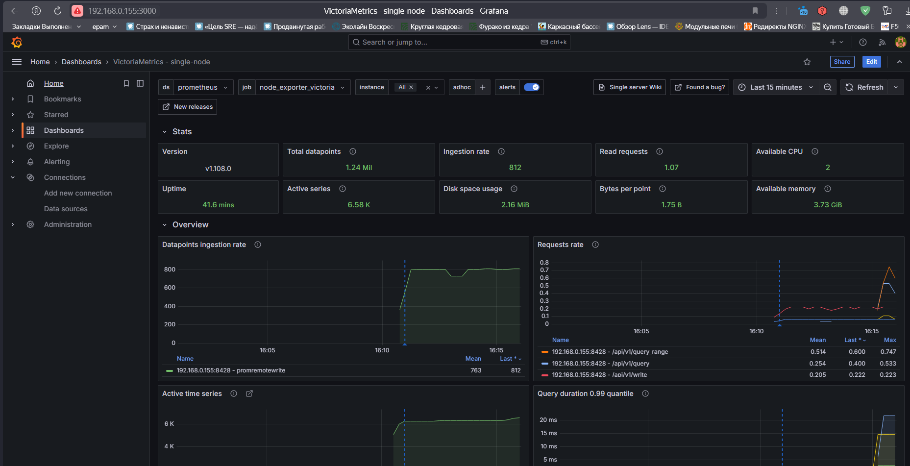

# GAP-1

## В данном репозитории находят роли для деплоя из Gitlab

### Для деплоя wordpress приложения необходимо выполнить job deploy-app


Результатом станет установка сервисов nginx, php, memcached, mysql и CMS wordpress

### Для деплоя системы мониторинга следует воспользоваться  job deploy-monitoring и deploy-exporters соответственно


Результатом будет установленный Prometeus, Grafana, набор exporters и AlertManager


# Подключение VictoriaMetric

Для установки VictoriaMetric следует выполнить роль  deploy-victoria. Конфигурирование Prometeus в данном примере осуществляется в ручную. Файл конфигурации находится в каталоге GAP1


### Подключаем хранилище Victoria к Grafana


### И подключим дашбор для мониторинга Victoria



# Настройка алертинга

Для обновление правил отправки алертов а также изменения самих алертов добавлена роль alert-update. Ознакомиться с файлами конфигурации можно в каталоге Gap1


Для приемки сообщений создан ТГ канал. с двуми трэдами Warning и Critical. Сообзения с различным severity поступают в соответствующий трэд


# Grafana - продвинутое использование


# Установка Zabbix

В ручную развернуты забикс-сервер изабикс-агент.


Cформировать скрипт генерирующий метрики:

```
import random
import json

# Создаём список метрик
metrics = [
    {"{#METRIC}": "biba", "{#VALUE}": random.randint(0, 100)},
    {"{#METRIC}": "boba", "{#VALUE}": random.randint(0, 100)},
    {"{#METRIC}": "ziza", "{#VALUE}": random.randint(0, 100)},
]

# Преобразуем в JSON и выводим
json_result = json.dumps(metrics, indent=4)
print(json_result)
```
Добавлен UserParametr для получения метрик из скрипта

```
UserParameter=otus[*], python3 /etc/zabbix/zabbix_agent2.d/test.py
```
Добавил правило обнаружения


Портотип итема


Портотип тригера**


** порог понижен до 80 так как не удавалось долго поймать срабатывание тригера

Убеждаемся что метрики обнаружилсь, тригеры добавились, данные поступают.


Настроена отправка оповещений в ТГ канал


