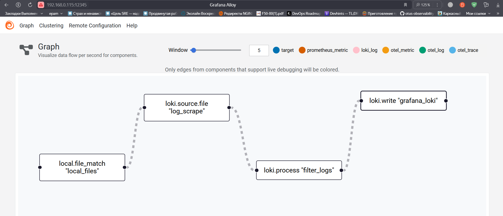
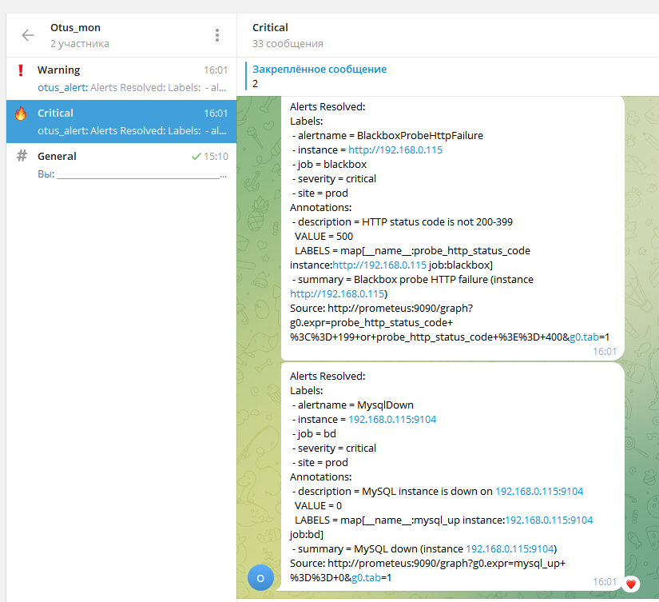

#  Описание
Репозиторий для выполнения проектной работы по курсу Observability в Otus

# Тема
Observability интернет магазина на платформе Bitrix

# Задача
В работе планируется развернуть на VM сайт на 1с  Bitrix. Настроить мониторинг, логирование и алертинг хоста, БД, surf party сервисов.

# Решение
## Подготовка инфраструктуры
Инфраструктура состоит из следуюших нод:

bitrix - нода для запуска интернет магазина на платформе Bitrix  
prometeus - для запуска  
loki - нода для агрегации локов  
gitlab - в качетсве инструмента CI/CD

В качестве стека мониторинга используются:

Exporter's - экспортеры метрик  
Prometheus - хранилище метрик  
Victoria Metrics - долговременное хранилище метрик  
Grafana Alloy - агент сбора логов  
Grafana Loki - система агрегации логов  
Grafana - визуализация  

### Тестовый сайт Bitrix запущен в ручную на VM в соответсвии с инструкциями вендора

### Для деплоя системы мониторинга следует воспользоваться нужными кнопками в Gitlab CI

## Дашборды и метрики
Метрики собираются при помощи отдельных экспортеров (node, nginx, blackbox). В графане мы получаем возможность наблюдать за  метриками передаваемыми экспортерами

###
Блэк бокс экспортер передает верхнеуровневые данные о работе сайта

 

На дашборде нод экспортера можно наблюдать за состоянием хоста в целом

Дашборд MYSQL отображает данные работы БД

## Логирование

С помощью Grafana Alloy организован сбор логов о работе сервисов

## Алертинг

Настроен алертинг о недоступности сайта, замедления времени ответа сайта, отключение и рестарта БД. Доставка уведомлений осуществляется в Telegram.

